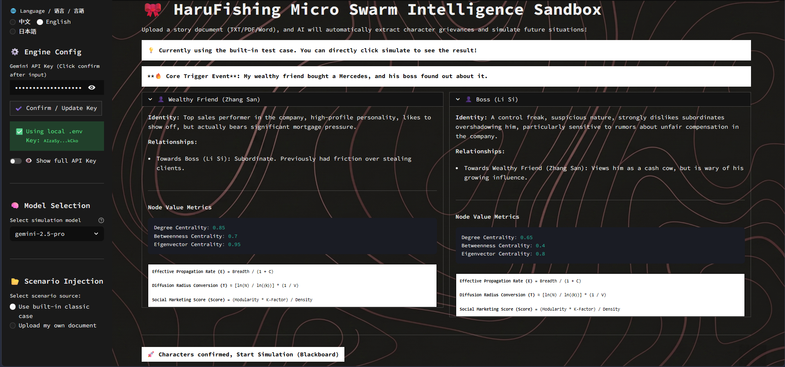
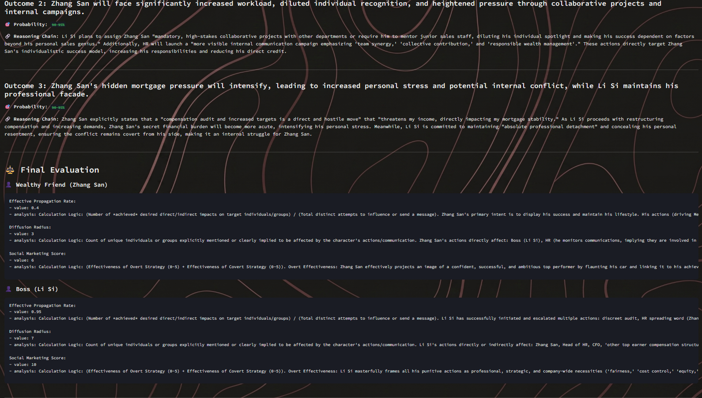
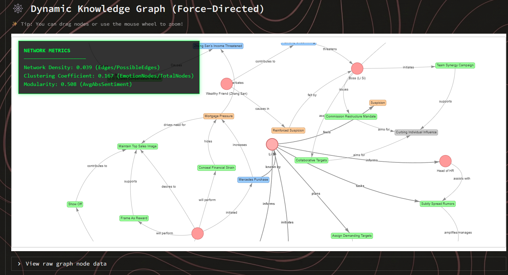



# HaruFishing 🎀

ミニマリストなマルチエージェント（Multi-Agent）ソーシャルサークル推論・予測エンジン。
*あらゆるドラマのバタフライエフェクトを予測し、エージェントたちがあなたのために演じます。*

[English](./README.md) | [中文介绍](./README_ZH.md) | [日本語](./README_JP.md)

## 📖 HaruFishingとは？

HaruFishingは、MiroFishなどのプロジェクトにインスパイアされた軽量な群知能サンドボックスです。トリガーとなるイベントと、キャラクターカード（性格、背景、人間関係など）のセットを入力すると、システムはこれらのキャラクターを演じる自律的なAIエージェントを自動的に生成します。エージェントたちはターン制の「黒板（Blackboard）」環境で対話し、心理戦や行動を示す力学モデルのナレッジグラフ（Knowledge Graph）を動的に生成します。

**主な利用シーン：**
- 🎭 **ストーリーや脚本の推論：** 予想外の展開に対してキャラクターがどう反応するかを予測します。
- 🏢 **社内政治のシミュレーション：** 職場の突発的な出来事が引き起こす連鎖反応を分析します。
- 🍉 **ゴシップ・人間関係サンドボックス：** チャット履歴、ニュース、またはPDFドキュメントを読み込ませ、ドラマがどう展開するかを観察します。

## 🚀 クイックスタート

### 必須環境
- Python 3.10 以上。
- 無料の [Google Gemini API Key](https://aistudio.google.com/)。

### オプション A: ワンクリック自動起動 (Windows)
シームレスで設定不要な起動体験を実現する自動バッチスクリプトを提供しています：
1. 启动_HaruFishing.bat をダブルクリックして実行します。
2. 画面の指示 (Y/N) に従って、Python（不足している場合）と必要なすべての依存ライブラリを自動インストールします。
3. Web UI がデフォルトのブラウザで自動的に開きます。

### オプション B: 手動起動
`ash
# 1. リポジトリをクローンまたはディレクトリに移動
cd D:\HaruFishing

# 2. 依存関係のインストール
python -m pip install -r requirements.txt

# 3. API Key の設定（または後で Web UI で直接入力）
echo GEMINI_API_KEY=ここにAPI_KEYを入力 > .env

# 4. Web UI の起動
python -m streamlit run ui/web_app.py
`

## 🏗️ アーキテクチャとコアモジュール

HaruFishingは、トークン消費を極限まで抑え、決定性の高い出力と強力なフォールトトレランスを確保するために、完全に疎結合された3つのモジュールアーキテクチャを採用しています。

*   **モジュール A: シナリオパーサー (core/ingestion.py)**
    *   **ドキュメント解析：** pypdf と python-docx を使用して、.txt、.pdf、または .docx からプレーンテキストを抽出します。
    *   **AI 抽出エンジン：** GeminiのJSONモードを厳密に使用し、長文からコアとなるイベント、キャラクターの性格、人間関係を全自動で抽出します。
    *   **プロンプト構築：** 抽出したデータを強力な System Prompts (config/prompts.py) に変換します。
*   **モジュール B: コア推論エンジン (core/engine.py)**
    *   **黒板システム（Blackboard）：** エージェントは共有のコンテキスト黒板上で、刻々と変化する状況に順番に反応します。
    *   **インクリメンタルなグラフ構築：** エージェントは各ターンの終了時に構造化されたJSONを出力し、ノードとエッジを動的に構築することで、トークンを大幅に節約します。
    *   **究極のフォールトトレランス：** 公式SDKを廃止し、デッドロックを防ぐ60秒のタイムアウト制御付きのネイティブHTTPリクエストを使用。さらに 	enacity を組み合わせて、APIレート制限 (429) に対するエクスポネンシャルバックオフの再試行を実現します。
*   **モジュール C: 審判ジェネレーター (core/synthesizer.py)**
    *   **ログの要約：** ロールプレイに参加しない「神の視点」を持つエージェント（The Observer）がインタラクションログを読み取り、近い将来に起こりうる3つの結末とその確率を予測します。
    *   **トークン最適化：** 長すぎるログを自動的に切り詰め、コンテキストウィンドウの制限を超えるのを防ぎます。
    *   **ソーシャルネットワーク定量評価 (SNA):** キャラクターの有効伝播率やソーシャルマーケティングスコアなどのハードコアな指標を自動計算し、計算論理とともに提示します。

## 🌐 ビジュアライゼーションと UI
フロントエンドは **Streamlit** (ui/web_app.py) をベースに構築されており、以下の特徴があります：
- **トリリンガルインターフェース：** English、中文（Chinese）、日本語を瞬時にシームレスに切り替え。
- **サイバーギークの美学：** 丸みのない絶対直角のモノクロデザイン、SVGフラクタルノイズによる等高線の暗紋背景、そしてクラシックな明朝体「Shippori Mincho」の採用により、サイバーパンクな雰囲気を最大限に引き出します。
- **リアルタイム監視パネル：** 動的グラフにフローティングパネルを追加し、ネットワーク密度やクラスタリング係数、モジュール性などのトポロジーデータをリアルタイムで計算・表示します。
- **デュアルモード入力：** 組み込みのクラシックなケースをワンクリックで実行することも、自分のドキュメントをドラッグ＆ドロップでアップロードしてカスタム抽出を行うこともできます。
- **動的ナレッジグラフ：** **Pyvis** を深く統合し、リアルタイムの力学モデルネットワークグラフをレンダリングします。マウスでノード（人物、イベント、アクション）を自由にドラッグし、複雑に絡み合う関係網を直感的に感じることができます！

## 📸 System Screenshots

 <em>Character Node Value Metrics & Initial Setup</em>  

 <em>Final Judgement & Quantitative Social Marketing Score</em>  

 <em>Real-Time Force-Directed Knowledge Graph</em>  

## ⚙️ 依存ライブラリの概要
- google-generativeai: コアとなる大規模言語モデル（LLM）との対話。
- pydantic: 厳密なデータスキーマとJSON検証。
- streamlit: Webアプリケーションフレームワーク。
- pyvis: インタラクティブなネットワークグラフのレンダリング。
- 	enacity: 強力なフォールトトレランスと再試行ロジック。
- pypdf & python-docx: 強力なドキュメント解析機能。

---
*Made with 🎀 by Haru & Mangolotis-anon*

